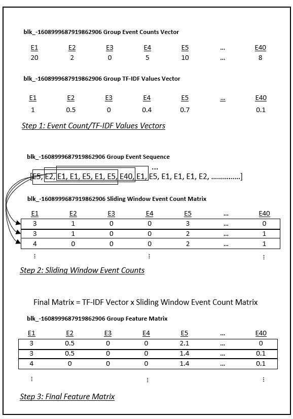

# Log Anomaly Detection

The log anomaly detection project uses a CNN model to detect anomalous log data. The project was completed as part of the Master of Data Science (MDS) program at the University of British Columbia (UBC).

The log anomaly detector uses the following steps:

- **Parse**: Parsing unstructured log data into a structured format consisting of log event template and log variables.
- **Feature Extraction**: TF-IDF on event counts and sliding windows to generate feature matrices.
- **Log Anomaly Detection Model**: CNN model using the feature matrices as inputs and trained using labelled log data.

The log anomaly detection model was tested using HDFS log data and was able to achieve test set precision, recall, and F-score values all greater than 99%.

## Data

Hadoop Distributed File System (HDFS) log data was used in this project to test the log anomaly detector. The data is provided by the [Loghub collection](https://github.com/logpai/loghub):
- Shilin He, Jieming Zhu, Pinjia He, Michael R. Lyu. [Loghub: A Large Collection of System Log Datasets towards Automated Log Analytics](https://arxiv.org/abs/2008.06448). *Arxiv*, 2020.

Information on the HDFS data can be found [here](https://github.com/logpai/loghub/tree/master/HDFS).

## Model Overview
### Parse

This project uses the Drain log parser available through the [Logparser toolkit](https://github.com/logpai/logparser). The Logparser toolkit provides multiple automated log parsing methods to create structured logs (also referred to as message template extraction). 

A description of Drain is provided at the following link:

- [Drain: An Online Log Parsing Approach with Fixed Depth Tree](https://jiemingzhu.github.io/pub/pjhe_icws2017.pdf), by Pinjia He, Jieming Zhu, Zibin Zheng, and Michael R. Lyu.

The raw unstructured HDFS log data is parsed using Drain to generate structured data in the form of log event templates and log variables.

The log variables are used to identify groups of log data identified in this case by HDFS block ids. Log messages with the same block id are grouped together and lists of the sequence of events within the each block id are generated.

The [parse](./parse) folder contains the code used for parsing and provides additional details.
### Feature Extraction

 Feature extraction is performed on each log message grouping based on HDFS block ids. Feature extraction uses the following steps:

 - **Event Counts/TF-IDF**: A count of events for each block id grouping is compiled using a bag of words approach. The total counts of each event for all groups is also compiled and TF-IDF is then applied resulting in a TF-IDF vector for each block id.
 - **Sliding Window Event Counts**: A sliding window that subsets the sequence of events within each block id is then applied. The event counts within each subset selection are used to generate a matrix for each block id with each subset event counts representing the rows.
 - **Final Feature Matrix**: The block id sliding window event count matrices are then multiplied by the corresponding block id TF-IDF vectors. This results in matrices based on TF-IDF values instead of event counts.

The [process](./process) folder contains the code used for feature extraction and provides additional details.

 ### Log Anomaly Detection Model
 
 The log anomaly detection model uses a shallow CNN architecture with two convolutional layers and two max pooling layers. The output from the last max pooling layer is passed into two multi-perceptron hidden layers. The final layer consists of two nodes representing anomalous and normal labels.

 The model was trained using the HDFS log data from [Loghub](https://github.com/logpai/loghub) which has block ids labelled as either normal or anomalous. An 80/20 test/train split was used.

 The [model](./model) folder contains a notebook with the CNN log anomaly detection detection model.

## Results

The results from the HDFS log data applied to the model are provided in the following tables. The results indicate that log anomaly detection process is performing extremely well based on the HDFS log dataset.

**Training Classification**

|  | True Normal | True Anomalous |
| --- | ---: | ---: |
| **Model Normal** | 305,731 | 22 |
| **Model Anomalous** | 46 | 9,808 |

 

**Testing Classification**

|  | True Normal | True Anomalous |
| --- | ---: | ---: |
| **Model Normal** | 118,553 | 5 |
| **Model Anomalous** | 1 | 1978 |

 

**Model Performance Metrics**

|  | Precision (%) | Recall (%) | F-Score (%) |
| --- | ---: | ---: | ---: |
| **Training** | 99.5 | 99.8 | 99.7
| **Testing** | 99.9 | 99.7 | 99.8

