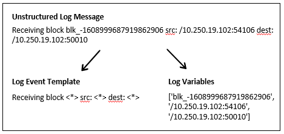

# Parse Folder

Contains code to parse raw unstructured log files to the structured form required by the feature extraction and anomaly detection algorithms.

## Drain Log Parser

This project uses the Drain log parser available through the [Logparser toolkit](https://github.com/logpai/logparser). The Logparser toolkit provides multiple automated log parsing methods to create structured logs (also referred to as message template extraction). Logparser was created as part of an evaluation of various parsers:
- [**ICSE'19**] Jieming Zhu, Shilin He, Jinyang Liu, Pinjia He, Qi Xie, Zibin Zheng, Michael R. Lyu. [Tools and Benchmarks for Automated Log Parsing](https://arxiv.org/pdf/1811.03509.pdf). *International Conference on Software Engineering (ICSE)*, 2019.
+ [**DSN'16**] Pinjia He, Jieming Zhu, Shilin He, Jian Li, Michael R. Lyu. [An Evaluation Study on Log Parsing and Its Use in Log Mining](https://jiemingzhu.github.io/pub/pjhe_dsn2016.pdf). *IEEE/IFIP International Conference on Dependable Systems and Networks (DSN)*, 2016.

Drain was identified as the most accurate parser as part of the evaluation and Logparser provides the implementation of Drain discussed in:
- [**ICWS'17**] [Drain: An Online Log Parsing Approach with Fixed Depth Tree](https://jiemingzhu.github.io/pub/pjhe_icws2017.pdf), by Pinjia He, Jieming Zhu, Zibin Zheng, and Michael R. Lyu.

**Note:** Drain as provided in the Logparser package is implemented in Python 2.7. The `requirements.txt` file provides the packages required to run drain. Documentation for Logparser can also be found [here](https://logparser.readthedocs.io/en/latest/README.html).

**Note:** An updated version of Drain is available at [IBM-Drain3](https://github.com/IBM/Drain3) and provides an implementation in Python 3. However, it is geared towards streaming log data and requires additional effort to run in the same framework provided by the original Drain parser. Implementation of Drain3 in this project may be completed at a later date. 

## Data and Scripts

The HDFS data used in this project is provided by the [Loghub collection](https://github.com/logpai/loghub):
- Shilin He, Jieming Zhu, Pinjia He, Michael R. Lyu. [Loghub: A Large Collection of System Log Datasets towards Automated Log Analytics](https://arxiv.org/abs/2008.06448). *Arxiv*, 2020.

Information on the HDFS data can be found [here](https://github.com/logpai/loghub/tree/master/HDFS).

The following data and scripts (excluding the code available in the Logparser package) include:

- `example_parser.py` runs Drain on `HDFS_2k.log` which contains 2,000 lines of HDFS log data. The script produces the log message template and structured log data output in csv format to the `example_parsed` folder. 
- `project_parser.py` runs Drain on the `HDFS.log` and `HDFS_train.log` files which contains approximately 11.2M and 8.9M lines of unstructured log data, respectively. The script produces the log message template and structured log data output in csv format to the `project_parsed` folder. Note that `HDFS.log`, `HDFS_train.log` and the output from `project_parser.py` are not stored in this repo as they are files larger than 1 GB. However, the `raw_data.ipynb ` file provides instructions on downloading the raw data and generating the parsed data.
- The `project_parsed` folder also contains the file `anomaly_label.csv` which provides a label whether each HDFS block in the `HDFS.log` file is normal or anomalous.

Note that the `*_parser.py` scripts are based on the Drain demo scripts available [here](https://github.com/logpai/logparser/tree/master/demo).

Additional details of the `HDFS.log` file are provided in the paper:
- Wei Xu, Ling Huang, Armando Fox, David Patterson, Michael Jordan. [Detecting Large-Scale System Problems by Mining Console Logs](https://people.eecs.berkeley.edu/~jordan/papers/xu-etal-sosp09.pdf), in Proc. of the 22nd ACM Symposium on Operating Systems Principles (SOSP), 2009. 

