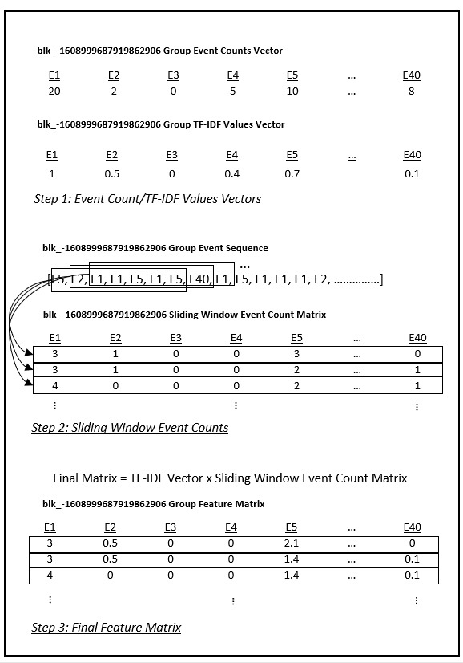

# Process Folder

Contains code to extract features from the structured log files produced within the [parse](../parse) directory. The data generated in this folder is used directly by the CNN model for log anomaly detection.

## Feature Extraction Overview

The code in this directory borrows some functionality from the [Loglizer](https://github.com/logpai/loglizer) project:

- Shilin He, Jieming Zhu, Pinjia He, Michael R. Lyu. [Experience Report: System Log Analysis for Anomaly Detection](https://jiemingzhu.github.io/pub/slhe_issre2016.pdf), *IEEE International Symposium on Software Reliability Engineering (ISSRE)*, 2016.

Loglizer takes structured log data and creates a list of log template events corresponding with each HDFS block id (or some other log grouping depending on the type of log data). Bag of Words (BoW) or TF-IDF is then completed on the lists of log events. This results in a dataframe with rows representing block ids, columns representing log event templates, and the values as the corresponding BoW or TF-IDF values. This dataframe can then be input to a predictive model.

This project uses the framework of Loglizer's feature extraction but uses the following approach adding functionality as required:

- **Event Counts/TF-IDF**: A count of events for each block id grouping is compiled using a bag of words approach. The total counts of each event for all groups is also compiled and TF-IDF is then applied resulting in a TF-IDF vector for each block id. This is the same functionality that exists in Loglizer.
 - **Sliding Window Event Counts**: A sliding window that subsets the sequence of events within each block id is then applied. The event counts within each subset selection are used to generate a matrix for each block id with each subset event counts representing the rows.
 - **Final Feature Matrix**: The block id sliding window event count matrices are then multiplied by the corresponding block id TF-IDF vectors. This results in matrices based on TF-IDF values instead of event counts.

 A representation of the process is provided below:

 

This feature extraction process is also similar to the approach used in:

- H. Li and Y. Li, LogSpy: System Log Anomaly Detection for Distributed Systems, 2020 International Conference on Artificial Intelligence and Computer Engineering (ICAICE), 2020, pp. 347-352, doi: 10.1109/ICAICE51518.2020.00073.

## Data and Scripts

The following provides a description of the files located in this folder:

- `sliding_window_processor.py` contains the functions used to generate the block event features as described above.

- `project_processor.py` uses the functions in `sliding_window_processor.py` to extract features from the data generated by `/parse/project_parser.py` and located in the `/parse/project_parsed` folder. Specifically, the files called by `project_processor.py` are:
    - `anomaly_label.csv` (anomalous/normal labels for HDFS blocks)
    - `HDFS_train.log_structured.csv` (training data)
    - `HDFS_test.log_structured.csv` (testing data)
- The processed data is then stored in the `project_processed_data` folder as:
    - `x_train_{version_and_details}.npy`
    - `x_test_{version_and_details}.npy`
    - `y_train_{version_and_details}.csv`
    - `y_test_{version_and_details}.csv`
- `process_demo.ipynb` provides a demo of using the processing script and is likely the best way to understand the feature extraction code at a high-level.

- `test_sliding_window_processor.py` provides a small number of tests for `sliding_window_processor.py`
